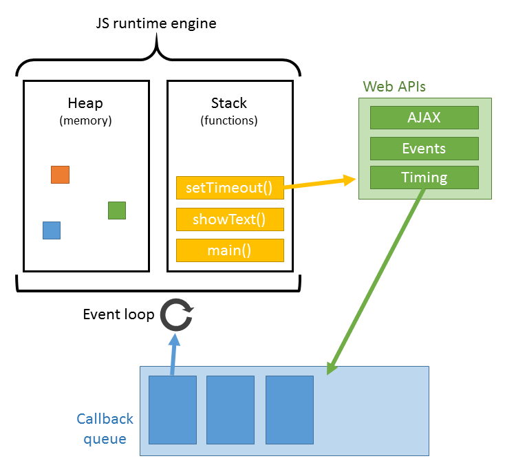

# The Event Loop



<iframe width="560" height="315" src="https://www.youtube.com/embed/8aGhZQkoFbQ" frameborder="0" allow="accelerometer; autoplay; clipboard-write; encrypted-media; gyroscope; picture-in-picture" allowfullscreen></iframe>

What is the event loop?

1. it's how javascript works
2. like a hoola hoop, but made of events

<details>
<summary>the answer is below</summary>

it's 1.

hoola hoops are plastic

</details>

## A little example

```js
console.log(1);
setTimeout(() => {
  console.log(3);
}, 0);
console.log(2);
```

## More examples and exercises

<!-- BEGIN DIR -->
<!-- END DIR -->
