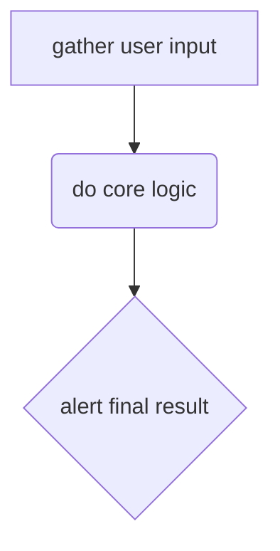

# Variables!

[<< Breakpoints and Debugging](../00-breakpoints-and-debugger/README.md?--defaults) | [Isolate](../README.md?--defaults) | [Value Swaps >>](../02-value-swaps/README.md?--defaults)

---

<details >
<summary>a parsons problem</summary>

<!-- ?parsons -->

```js
/* 1 */
const a = 1;

/* 2 */
const b = 2;

const c = 3; // distractor
```

</details>

<!-- ?tutor -->

```js
const a = 1;
const b = 2;
const c = 3;
```



## Examples & Exercises

<!-- begin dir -->
<!-- end dir -->
