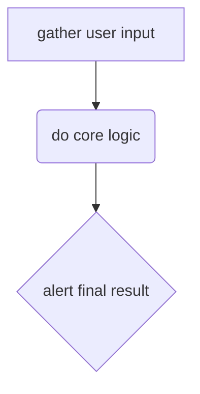

<!-- global configs in a comment. tbd -->

<!-- embed diagrams or images -->

<!--  -->

<!-- embed local mp4's for offline study -->

<!-- <video></video> -->

<!-- also embedded youtubes/vimeos -->

<!-- <iframe></iframe> -->

<!-- this code bloc will become a live-study, you can configure individual snippets with a comment before them. details tbd -->

```js
const x = 3;
console.log(x);
```

<!-- comment config to render the next code block as a parsons problem -->

<details>
<summary>a collapsed parsons problem</summary>
<br>

<!-- ?parsons -->

```js
const x = 3;
console.log(x);

const y = 3; // distractor
```

</details>

<!-- ?study -->

```js
const x = 3;
console.log(x);

const y = 3; // distractor
```

<!-- render the next code-block as a js-tutor iframe (language is inferred by code block) -->
<!-- ?tutor -->

```js
const x = { a: 1, b: 2, c: 3 };
((e) => {
  x.f = "n";
})(x);
```

<details>
<summary>a collapsed tutor</summary>
<br>

<!-- ?tutor -->

```js
const x = { a: 1, b: 2, c: 3 };
((e) => {
  x.f = "n";
})(x);
```

</details>

<!-- renders mermaid diagrams -->



<!-- have quizzes -->

### simple with summary/details

what's the answer?

1. a
2. b
3. c

<details>
   <summary>the answer</summary>
   <br>

it's 3: b

</details>

### fancy with JSON config

<!-- ?quiz -->

```json
{
  "question": "markdown",
  "options": {
    "a": {
      "text": "markdown",
      "correct": true,
      "feedback": "markdown"
    },
    "b": {
      "text": "markdown",
      "correct": false,
      "feedback": "markdown"
    }
  }
}
```

## Dir

<!-- begin dir -->
<!-- end dir -->

## Dependencies

> ala /j-l/recursion

<!-- study:dependency -->

```js
const visRecursion = () => {};
```
