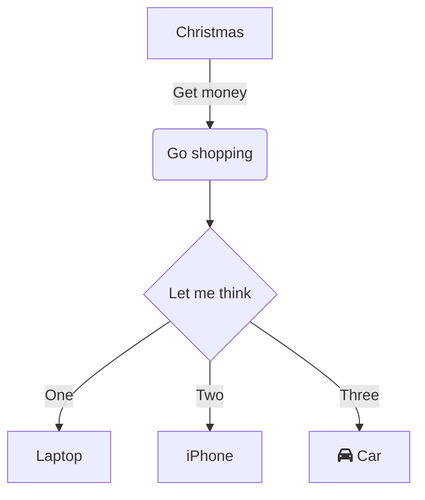
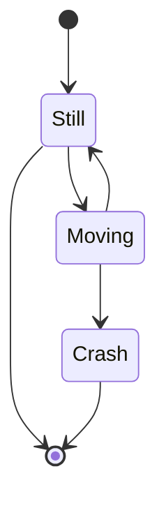

# 1

```js
const x = 'hello';
console.log(x);
const y = (x) => {
  for (let i = 0; i < 3; i++) {
    if (x !== 0) {
      return x + 3;
    } else {
      while (i !== 2) {
        i++;
      }
    }
  }
}

const x = 'hello';
console.log(x);
const y = (x) => {
  for (let i = 0; i < 3; i++) {
    if (x !== 0) {
      return x + 3;
    } else {
      while (i !== 2) {
        i++;
      }
    }
  }
}
```

---

## 2

sdfasfas sdfasfas

sdfasfassdfasfassdfasfassdfasfassdfasfas
sdfasfassdfasfassdfasfassdfasfassdfasfas

sdfasfassdfasfassdfasfassdfasfassdfasfas

```js
const y = 'bye';
```

```markdown
## asfd

- [ ] asdf
[asdf](asd)
```

```html
<h1 style="asdf">asdf</h1>
```

```json
{
  "asdf": 3,
  "zxcv": "3",
  "qwer": true,
  "sdfg": null
}
```


```bash
cd ./
```

```css
.example-gradient {
	background: -webkit-linear-gradient(left,     #cb60b3 0%, #c146a1 50%, #a80077 51%, #db36a4 100%); /* Chrome10+, Safari5.1+ */
	background:    -moz-linear-gradient(left,     #cb60b3 0%, #c146a1 50%, #a80077 51%, #db36a4 100%); /* FF3.6+ */
	background:     -ms-linear-gradient(left,     #cb60b3 0%, #c146a1 50%, #a80077 51%, #db36a4 100%); /* IE10+ */
	background:      -o-linear-gradient(left,     #cb60b3 0%, #c146a1 50%, #a80077 51%, #db36a4 100%); /* Opera 11.10+ */
	background:         linear-gradient(to right, #cb60b3 0%, #c146a1 50%, #a80077 51%, #db36a4 100%); /* W3C */
}
.example-angle {
	transform: rotate(10deg);
}
.example-color {
	color: rgba(255, 0, 0, 0.2);
	background: purple;
	border: 1px solid hsl(100, 70%, 40%);
}
.example-easing {
	transition-timing-function: linear;
}
.example-time {
	transition-duration: 3s;
}
```





