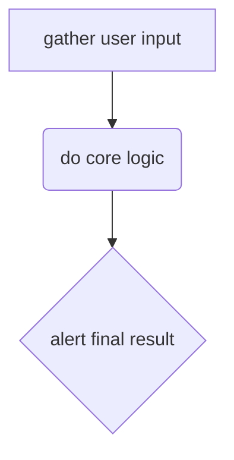

<!-- live-study literate js-tutor -->

# Prompt/Alert

`prompt` and `alert` are functions you can use for user I/O



1. [gather user input](#gather-user-input)
2. [do logic](#do-logic)
3. [alert user](#alert-user)

---

## Gather User Input


use `prompt` to gather user input.  the `||` is there so that the input is type string even if the user clicks cancel

```js
const userInput = prompt('enter something') || '';
const typeofUserInput = typeof userInput;
const inputAsNumber = Number(userInput);
const typeofInputAsNumber = typeof inputAsNumber;
```

---

## Do logic

do something clever with the user input.  this will result in a the final output of your program

<details>
<summary>what is the <code>_ ? _ : _</code> called in JS?</summary>
the _ternary_ operator.
</details>

```js
const response = userInput > 4 ? userInput : 'too short';
console.log(typeof response);
if (true) {
  console.log(3)
}
```

---

## Alert user

alert the final result you calculated in the last step

```js
alert(response);
```

